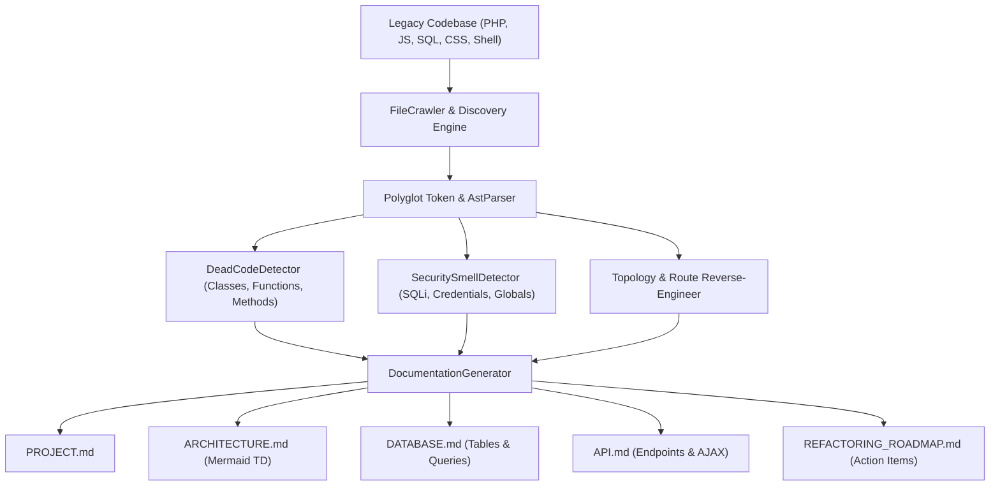

[🇸🇦 العربية](README.ar.md) | [🇬🇧 English](README.md)

# 🏛️ eidcloud-project-archaeologist

> **Deep legacy codebase excavation, static architecture reverse-engineering, dead code detector, and automatic documentation generator in pure PHP 8.2+.**

[](https://github.com/shadialhasan/eidcloud-project-archaeologist/releases)
[](https://www.php.net/)
[](LICENSE)
[](https://colab.research.google.com/github/shadialhasan/eidcloud-project-archaeologist/blob/main/notebooks/quickstart.ipynb)

---

## 🧭 Architecture Flow



---

## ⚡ Core Capabilities

- **Zero External Dependencies**: 100% native PHP 8.2+ without requiring composer vendor packages.
- **Polyglot Excavation**: Dissects multi-decade codebases spanning PHP, JavaScript, SQL, CSS, and Shell automation scripts.
- **Static Architecture Reverse-Engineering**:
  - Maps global ingress entry points (HTTP Front-controllers, CLI scripts, cron workers).
  - Reverse engineers routing flows (framework routers, procedural `$_GET['action']` dispatchers, express/fetch calls).
  - Reverse engineers database entity relationships from embedded DDL and queries.
  - Maps third-party external dependencies and legacy PHP extensions.
- **Dead Code & Abandoned Symbol Detection**: Scans declared classes, traits, interfaces, and methods for zero call-sites across the entire codebase.
- **Security Smell & Anti-Pattern Analysis**: Detects hardcoded secrets, raw SQL concatenation (SQL injection risks), `eval`/`system` execution, `extract($_GET)` superglobal overwriting, and legacy `mysql_*` functions.
- **Automatic Documentation Generation**: Generates 5 comprehensive markdown artifacts (`PROJECT.md`, `ARCHITECTURE.md`, `DATABASE.md`, `API.md`, and `REFACTORING_ROADMAP.md`).

---

## 🚀 Installation & CLI Usage

### Standalone (Zero Composer Required)
```bash
git clone https://github.com/shadialhasan/eidcloud-project-archaeologist.git
cd eidcloud-project-archaeologist
```

### CLI Command Options

#### 1. Full Excavation & Documentation Synthesis
```bash
php bin/eidcloud-archaeologist excavate ./path/to/legacy_project/ --out=./docs/
```
Outputs:
- `./docs/PROJECT.md`
- `./docs/ARCHITECTURE.md`
- `./docs/DATABASE.md`
- `./docs/API.md`
- `./docs/REFACTORING_ROADMAP.md`

#### 2. Scan Dead Code Only
```bash
php bin/eidcloud-archaeologist dead-code ./path/to/legacy_project/
```

#### 3. Output Mermaid Architectural Diagram
```bash
php bin/eidcloud-archaeologist architecture-map ./path/to/legacy_project/ --mermaid
```

#### 4. JSON Output for CI/CD Pipelines
```bash
php bin/eidcloud-archaeologist excavate ./path/to/legacy_project/ --json
```

---

## 🧪 Automated Testing

Run the zero-dependency test suite:
```bash
php tests/run_tests.php
```

---

## 👨‍💻 Author & Maintainer

**Eng. MHD. Shadi AL-Hasan**  
- **Location**: Damascus, Syria  
- **Email**: [mhd.shadi.alhasan@gmail.com](mailto:mhd.shadi.alhasan@gmail.com)  
- **Phone / WhatsApp**: +963934005922  
- **GitHub**: [@shadialhasan](https://github.com/shadialhasan)  

---

## 📄 License

This software is released under the **MIT License**. See [LICENSE](LICENSE) for details.  
Copyright (c) 2026 MHD. Shadi AL-Hasan.

---

## 👤 Author & Maintainer

**Eng. MHD. Shadi AL-Hasan**  
- **Role:** Executive CTO & Enterprise Solutions Architect  
- **Email:** [mhd.shadi.alhasan@gmail.com](mailto:mhd.shadi.alhasan@gmail.com)  
- **Phone / WhatsApp:** [+963934005922](tel:+963934005922)  
- **Location:** Damascus, Syria  
- **GitHub:** [shadialhasan](https://github.com/shadialhasan)  

---

## 📄 License

This project is licensed under the MIT License - see the [LICENSE](LICENSE) file for details.  
Copyright (c) 2026 **MHD. Shadi AL-Hasan**. All rights reserved.
